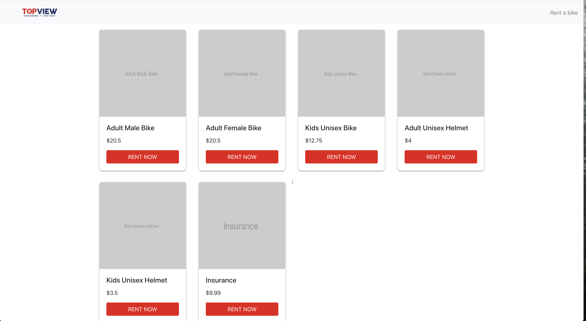

# Topview interview challenge

Create a simple webpage where users can rent a bike. Load bike data from a local JSON file.

## Live Site:

https://mgilliland23.github.io/topview/

Responsice styling using [bootstrap 4](https://getbootstrap.com/docs/4.0/getting-started/introduction/)

This project was bootstrapped with [Create React App](https://github.com/facebook/create-react-app).

